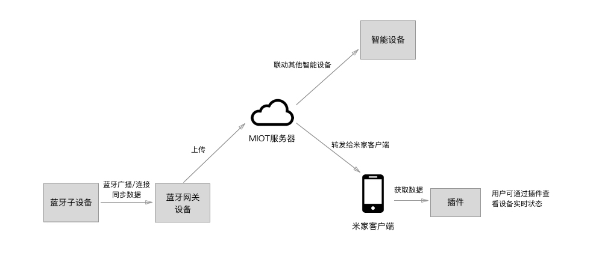

# 插件支持蓝牙网关说明

蓝牙网关设备具有米家 WiFi + BLE 双模通信能力，允许支持米家蓝牙协议的纯 BLE 设备通过其接入互联网。大致原理如下：



更多蓝牙网关信息请参考小米 IoT 开发者平台。


作为支持米家蓝牙协议的纯蓝牙设备，若处于蓝牙网关可扫描的范围内，则认为该蓝牙设备已经与蓝牙网关“连接”，蓝牙网关会实时接收蓝牙设备广播的数据，上报至云端。则：

1，用户通过米家 App 查看该蓝牙设备时，无需跟设备直接建立蓝牙连接，可查看设备上报的历史数据；

2，设备显示为在线，无需手机与设备建立连接。

注意，蓝牙设备“连接”蓝牙网关的前提是，两者处于同一小米账号下。

#### 蓝牙设备

蓝牙设备插件可以通过 `MHPluginSDK` 模块中以下接口支持蓝牙网关功能：

#### *isBtGateWaySubDeviceWithMac(mac, callback)* `AL-[130,)`

该接口可实时判断蓝牙设备是否与蓝牙网关“连接”

参数说明：

`mac`  蓝牙设备的 mac 地址

`callback`  返回数据格式为数组，若设备未与蓝牙网关连接则返回 `[0]` ，若与蓝牙网关连接则返回 `[1, gateway_mac]`，gateway_mac 为蓝牙设备“连接”的蓝牙网关的 mac 地址。

示例：

```javascript
MHPluginSDK.isBtGateWaySubDeviceWithMac(xxxxxxxxxxxx,(res)=>{
	if(!res){
		// 未连接
		return;
	}
	// 已连接
});
```


#### *callSmartHomeAPI(api, params, callback)*

调用米家云端 API ，查询蓝牙设备上报至云端的历史数据。

api 包括 `/user/get_user_device_data` 读取时间相关数据与`/device/batchdevicedatas`读取时间无关数据，请求参数与示例见 [MHPluginSDK 模块说明](https://github.com/MiEcosystem/ios-rn-sdk/blob/master/MiHomePluginSDK/docs/MHPluginSDK.md#callsmarthomeapiapi-params-callback)。


#### 蓝牙网关

#### *openBtGatewayPage()*  `AL-[130,)`

打开蓝牙网关设备页面，查看该网关下的子设备。无参数。插件厂商需根据设备实际情况（是否是蓝牙网关设备，是否有固件版本限制等）来决定是否调用该接口。


如遇问题请提交 [issue](https://github.com/MiEcosystem/ios-rn-sdk/issues/new)。